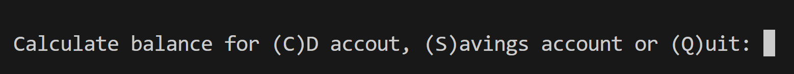
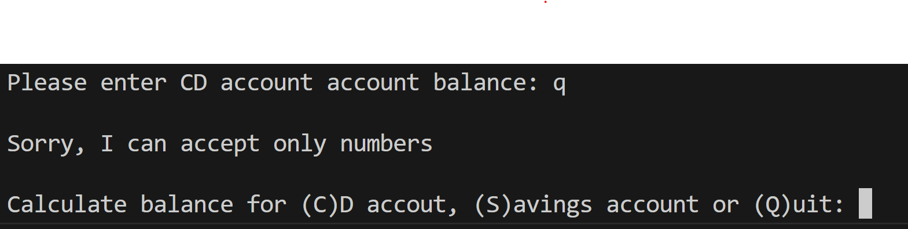
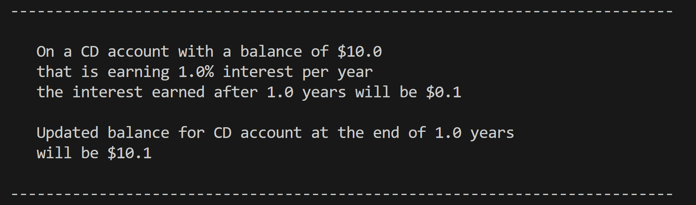

#python-challenge-1
# Module 3 Challenge
## Customer banking

**Contents**

* [Description](#description)
* [Features](#features)
* [How does it work](#how-does-it-work?)
* [Concepts used](#cencepts-used)

### Description
This is a customer facing banking application desgined to offer to "customer" a way to  calculate and track interested earned on savings and CD account. The application is designed to utilize basic concepts of object oriented programming.

### Features
* User is prompted to select an account type to know how much interest will be earned for an account. User is promoted to enter in uppercase though application is designed for user to enter selection in either case.

    

* User is promted to give their inputs on balance, interest rate and time horizon to calculate interest

* Validation is done for each prompt to ensure user has entered an integer, If user inadvertantly enters a non integer charatcer, application display the erros and loops the user back to account selection. Though this was not a requirement of the challenge, I considered it a good step considering calcuations are involved
    

* Once all information is correctly entered, screen displays 
    * Interest calculated
    * Total balance with interest at the end of time horizon

    

* Application loops back the user to account type selection prompt
* The prompt shows selecting Q to (Q)uit the application. User can also enter any other key to quit the application.   

### How does it work?
* The application covers (4) files
    1. Account.py
    2. customer_banking.py
    3. savings_account.py
    4. cd_account.py

* Application is executed from customer_banking.py.
* Prompts entered by user are used to call respective functions for savings account or CD account.
* The methods are located in their individual files. Each method is imported into customer_banking.py
* The calculations are carried out as part of the functions by passing the parameters to the function.
* In each of the account files, Account funtion is imported to be able to update interest and updated principal amount to respective accounts.

## Cencepts used
1. Object oriented programming
2. Importing functions
3. Passing variables to an external function
4. Match/Case
5. While loops
6. Nested looping
